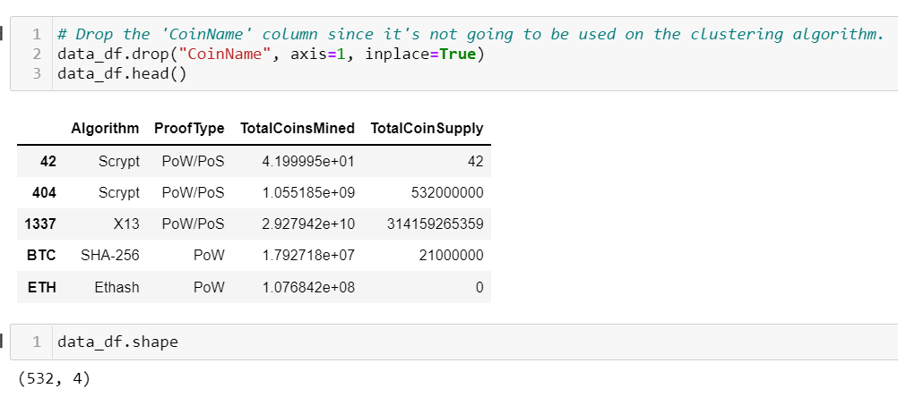
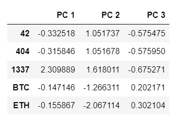
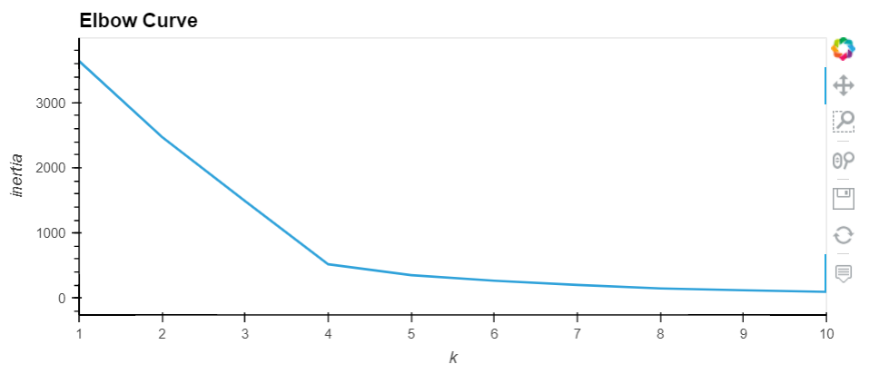
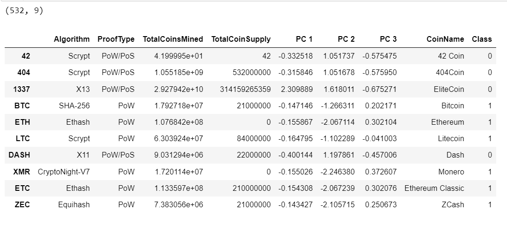
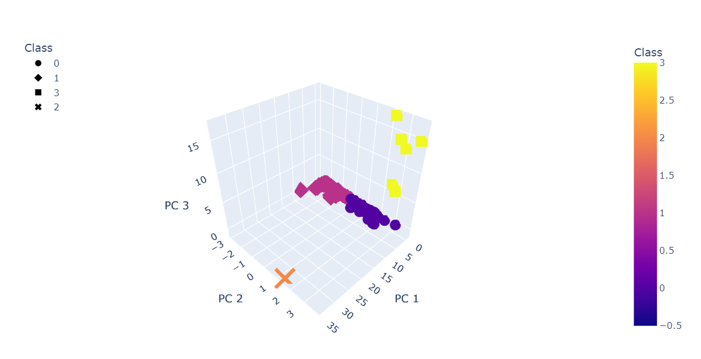
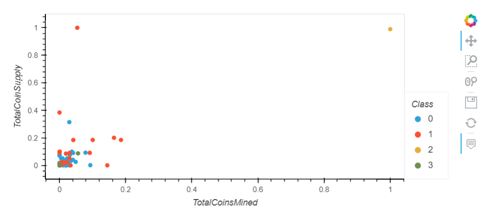

#  Cryptocurrencies
You and your childhood friend, Martha, dreamed of changing the world.  Martha wants to pitch an investment in cryptocurrencies to her firm, Accountability Accounting.  Their popularity has driven prices up and are often unaffordable for new investors.  However, there are many more types at more affordable prices. She has a dataset of cryptocurrencies and can analyze it any way she wants.  You will help her discover trends to convince her firm to invest in these new currencies.

## Resources
Software(s): Python 3.7, Scikit-Learn 0.24.1, Plotly, hvPlot 0.7.3, Pandas 1.2.4, Jupyter Notebook

## Purpose
Accountability Accounting, a prominent investment bank, is interested in offering a new cryptocurrency investment portfolio for its customers. The company, however, is lost in the vast universe of cryptocurrencies. So, they’ve asked you to create a report that includes what cryptocurrencies are on the trading market and how they could be grouped to create a classification system for this new investment.

The data Martha will be working with is not ideal, so it will need to be processed to fit the machine learning models. Since there is no known output for what Martha is looking for, she has decided to use unsupervised learning. To group the cryptocurrencies, Martha decided on a clustering algorithm. She’ll use data visualizations to share her findings with the board.

## Results

* Deliverable 1 Instructions  
Using your knowledge of Pandas, you’ll preprocess the dataset in order to perform PCA in Deliverable 2. 

 

* Deliverable 2 Instructions  
Using your knowledge of how to apply the Principal Component Analysis (PCA) algorithm, you’ll reduce the dimensions of the X DataFrame to three principal components and place these dimensions in a new DataFrame. 

 

* Deliverable 3 Instructions  
Using your knowledge of the K-means algorithm, you’ll create an elbow curve using hvPlot to find the best value for K from the pcs_df DataFrame created in Deliverable 2. Then, you’ll run the K-means algorithm to predict the K clusters for the cryptocurrencies’ data. 

 

 

* Deliverable 4 Instructions  
Using your knowledge of creating scatter plots with Plotly Express and hvplot, you’ll visualize the distinct groups that correspond to the three principal components you created in Deliverable 2, then you’ll create a table with all the currently tradable cryptocurrencies using the hvplot.table() function. 

 

 

